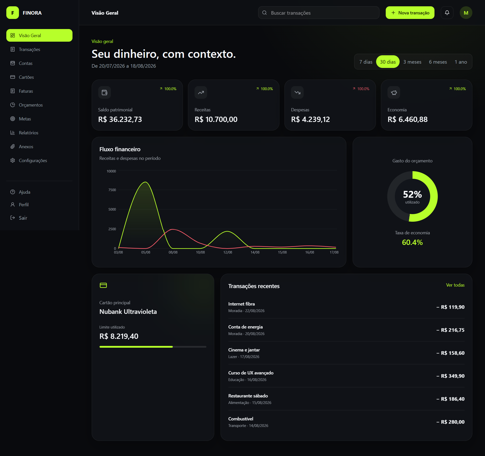
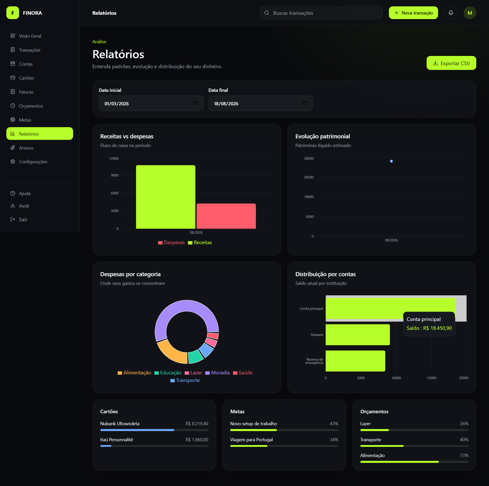
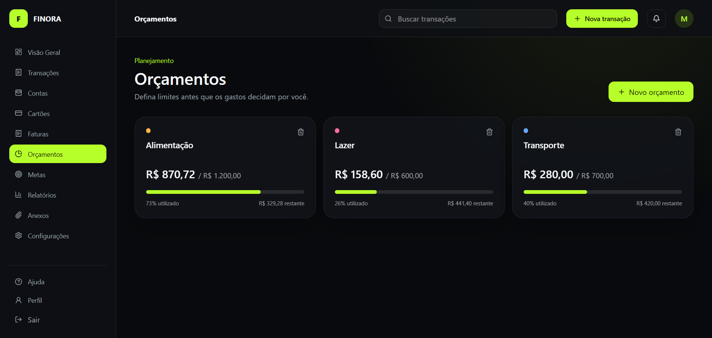

<div align="center">

# FINORA

### Gestão financeira pessoal com clareza, contexto e decisões melhores

Aplicação full stack para organizar contas, transações, cartões, faturas, orçamentos e metas em uma experiência moderna e responsiva.

[🚀 Acessar aplicação](https://finora-beta-six.vercel.app) · [Demonstração](#demonstração) · [Funcionalidades](#funcionalidades) · [Tecnologias](#tecnologias) · [Execução local](#execução-local) · [Arquitetura](#arquitetura)

</div>

## Sobre o projeto

O Finora é um projeto de portfólio desenvolvido em sete sprints. A plataforma reúne o ciclo financeiro pessoal em um único lugar: autenticação segura, movimentações, compras parceladas, faturas, planejamento, metas e análises visuais.

O frontend consome uma API REST versionada e a regra de negócio permanece independente da interface e dos provedores de infraestrutura. Comprovantes usam uma abstração `StorageService`, atualmente implementada com armazenamento local no ambiente de desenvolvimento.

## Demonstração

### Dashboard



### Relatórios



### Orçamentos



## Funcionalidades

- cadastro, login, refresh token, recuperação de senha e rotas protegidas;
- gestão de contas, categorias e transações;
- pesquisa, filtros avançados, ordenação, paginação, edição e duplicação;
- transações recorrentes e anexos de comprovantes;
- cartões de crédito, compras parceladas, limites e faturas;
- fechamento, vencimento e pagamento de faturas;
- orçamentos mensais com progresso e alertas;
- metas financeiras, contribuições e previsão de conclusão;
- dashboard com saldo, receitas, despesas, economia e fluxo financeiro;
- relatórios por período, categorias, contas, cartões, metas e orçamentos;
- exportação de relatórios em CSV;
- busca global, notificações internas, perfil, ajuda e configurações;
- estados de carregamento, erro, retry e feedback amigável;
- layout responsivo e verificações automatizadas de acessibilidade.

## Tecnologias

| Área | Tecnologias |
| --- | --- |
| Frontend | Next.js 16, React 19, TypeScript, Tailwind CSS, Redux Toolkit, TanStack Query, Axios, React Hook Form, Zod e Recharts |
| Backend | Python 3.12, FastAPI, Pydantic, SQLAlchemy e Alembic |
| Banco | PostgreSQL |
| Autenticação | JWT em cookies HttpOnly, refresh token e hash Argon2 |
| Testes | Jest, React Testing Library, MSW, Playwright, Pytest e coverage |
| Qualidade | ESLint, TypeScript, Ruff, MyPy e orçamento de performance |
| Infraestrutura | Docker, Docker Compose, GitHub Actions e Vercel Services |

## Arquitetura

```text
Navegador
   ├── Next.js / React
   │      ├── TanStack Query → estado do servidor
   │      └── Redux Toolkit → preferências globais
   └── API REST /api/v1
          └── FastAPI
                ├── Routes → Services → Repositories
                ├── SQLAlchemy → PostgreSQL
                └── StorageService → armazenamento local
```

O backend diferencia erros de validação, autenticação, autorização, negócio e servidor. Respostas são padronizadas e informações internas não são expostas em produção. Veja [arquitetura](docs/architecture.md) e [modelo de dados](docs/data-model.md).

## Estrutura do repositório

```text
FINORA/
├── frontend/                 # Next.js App Router
├── backend/                  # FastAPI, domínio e migrations
├── docs/                     # Arquitetura, imagens e sprints
├── .github/workflows/        # CI e deploy
├── compose.yaml              # Ambiente local completo
└── vercel.json               # Frontend + backend na Vercel
```

## Execução local

### Pré-requisitos

- Docker Desktop com Docker Compose; ou
- Node.js 22, Python 3.12 e PostgreSQL 16.

### Com Docker

```bash
cp .env.example .env
docker compose up --build
```

- aplicação: `http://localhost:3000`
- API: `http://localhost:8000/api/v1`
- OpenAPI: `http://localhost:8000/docs`

Os containers executam as migrations do Alembic durante a inicialização do backend.

## Qualidade e testes

```bash
# Frontend
cd frontend
npm ci
npm run lint
npm run type-check
npm test
npm run build
npm run performance
npm run test:e2e

# Backend
cd backend
pip install -e ".[dev]"
ruff check app tests
mypy app
pytest
```

Última validação local:

- 18 testes Pytest e 93% de cobertura no backend;
- Jest e Playwright em desktop e mobile;
- build de produção aprovado;
- JavaScript abaixo do orçamento de 3 MB;
- acessibilidade automatizada sem violações detectáveis.

## Deploy

O projeto utiliza Vercel Services para publicar Next.js e FastAPI no mesmo domínio. O PostgreSQL de produção é configurado por `DATABASE_URL`.

```env
DATABASE_URL=
JWT_SECRET_KEY=
ENVIRONMENT=production
COOKIE_SECURE=true
```

O workflow usa `VERCEL_TOKEN`, `VERCEL_ORG_ID` e `VERCEL_PROJECT_ID` como secrets protegidos do GitHub.

> O armazenamento local de anexos é adequado ao desenvolvimento e portfólio. Em ambientes serverless, arquivos locais são efêmeros; armazenamento persistente em nuvem permanece uma evolução futura por meio da abstração `StorageService`.

## Segurança

- senhas protegidas com Argon2;
- cookies HttpOnly e refresh tokens revogáveis;
- isolamento de dados por usuário;
- validação com Pydantic e Zod;
- erros sem stack traces em produção;
- secrets fora do repositório.

## Roadmap futuro

- armazenamento persistente de comprovantes em nuvem;
- importação de extratos OFX/CSV;
- categorização automática configurável;
- notificações por e-mail;
- compartilhamento familiar;
- aplicação móvel.

## Desenvolvimento assistido por IA

O Finora foi desenvolvido por **Kamilly Araújo** com a assistência do **OpenAI Codex** como ferramenta de apoio ao processo de desenvolvimento. A IA colaborou na implementação, revisão e documentação do projeto, sempre sob supervisão humana.

As decisões de produto e arquitetura, a análise do código, a validação dos resultados e a aprovação final de cada alteração foram realizadas pela autora, que permanece responsável pelo projeto e por sua evolução.

## Autora

Desenvolvido por **Kamilly Araújo** como projeto de portfólio full stack.

## Licença

Disponível para fins de estudo e portfólio.
